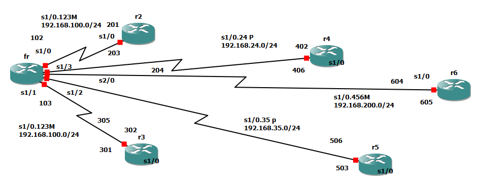

# 📖 보충 설명: 종합 실습의 의미

지금까지 익힌 **Multipoint + Point-to-Point 혼합 구성**을 실제 토폴로지에 적용하는 단계입니다.  
실무에서 자주 마주치는 **하이브리드 시나리오**를 다룹니다.

```
              [R2 Hub]
       Multipoint S0/0.1
       ┌──────────┼──────────┐
      R3         R4         R5     ← Multipoint 그룹
       │
       │  P2P 별도 링크
       │
      R6                            ← P2P 연결
```

---

## 🎯 학습 포인트

| 항목 | 설명 |
|------|------|
| **혼합 설계** | Hub에 Multipoint + P2P 서브인터페이스 동시 운용 |
| **서브넷 설계** | Multipoint 그룹은 같은 서브넷, P2P는 별도 서브넷 |
| **트러블슈팅** | 각 모드별로 다른 검증 방식 적용 |
| **실무 감각** | 노드별 특성에 맞춰 모드를 다르게 적용하는 사고 |

---

## 📌 설계 시 체크리스트

```text
□ DLCI 번호 충돌 없는지
□ Multipoint 그룹의 frame-relay map에 broadcast 키워드 누락 없는지
□ P2P 서브인터페이스는 frame-relay interface-dlci 사용 확인
□ 라우팅 프로토콜의 split-horizon 처리 확인
□ OSPF network type 일치 여부 (양쪽 라우터)
□ show frame-relay pvc 상태 ACTIVE 확인
```

---


# 6. Lab - Frame-Relay 종합 실습

> **Multipoint + Point-to-Point 혼합 구성**  
> 6대 라우터(R2~R6) + FR-Switch 구성

## 🗺 토폴로지



```
                                     R4
                                  402 |
                            204       |    s1/0.24 P2P
                                      |    192.168.24.0/24
              R2(201,203)             |
   s1/0.123 M ───┐                    ├─── 406
   192.168.100.0/24 ─── [FR-Switch] ──┤
              R3(301,302)             ├─── R6 (604,605)
   s1/0.123 M ───┘                    │    s1/0.456 Multipoint
                              305     │    192.168.200.0/24
                                      │
                              503     │
                                      └─── R5
                                           s1/0.35 P2P (192.168.35.0/24)
                                           s1/0.456 Multipoint
```

### 네트워크 구성
| 네트워크 | 구간 | 방식 |
|----------|------|------|
| 192.168.100.0/24 | R2 ↔ R3 | Multipoint (s1/0.123) |
| 192.168.24.0/24  | R2 ↔ R4 | Point-to-Point (s1/0.24) |
| 192.168.35.0/24  | R3 ↔ R5 | Point-to-Point (s1/0.35) |
| 192.168.200.0/24 | R4 ↔ R5 ↔ R6 | Multipoint (s1/0.456) |

### DLCI 매핑
| 라우터 | 인터페이스 | DLCI |
|--------|------------|------|
| R2 | s1/0 (→FR) | 201, 203, 204 |
| R3 | s1/0 (→FR) | 301, 302, 305 |
| R4 | s1/0 (→FR) | 402, 406 |
| R5 | s1/0 (→FR) | 503, 506 |
| R6 | s1/0 (→FR) | 604, 605 |

---

## ⚙ FR-Switch (fr) 설정

```cisco
en
conf t
!
no ip routing
frame-relay switching
!
! R2 방향
interface serial 1/0
 no shutdown
 encapsulation frame-relay
 frame-relay intf-type dce
 clock rate 2000000
 frame-relay route 201 interface s1/1 301
 frame-relay route 203 interface s1/1 302
 frame-relay route 204 interface s1/3 402
!
! R3 방향
interface serial 1/1
 no shutdown
 encapsulation frame-relay
 frame-relay intf-type dce
 clock rate 2000000
 frame-relay route 301 interface s1/0 201
 frame-relay route 302 interface s1/0 203
 frame-relay route 305 interface s1/2 503
!
! R4 방향
interface serial 1/3
 no shutdown
 encapsulation frame-relay
 frame-relay intf-type dce
 clock rate 2000000
 frame-relay route 402 interface s1/0 204
 frame-relay route 406 interface s2/0 604
!
! R5 방향
interface serial 1/2
 no shutdown
 encapsulation frame-relay
 frame-relay intf-type dce
 clock rate 2000000
 frame-relay route 503 interface s1/1 305
 frame-relay route 506 interface s2/0 605
!
! R6 방향
interface serial 2/0
 no shutdown
 encapsulation frame-relay
 frame-relay intf-type dce
 clock rate 2000000
 frame-relay route 604 interface s1/3 406
 frame-relay route 605 interface s1/2 506
```

---

## ⚙ 라우터 기본 설정 (공통)

```cisco
enable
configure terminal
!
no ip domain-lookup
!
line console 0
 logging sy
 exec-timeout 0 0
!
hostname R2     ! ← 각 라우터마다 R2/R3/R4/R5/R6/FRSW로 변경
```

---

## ⚙ 라우터 설정

### R2
```cisco
en
conf t
!
interface serial 1/0
 no shutdown
 encapsulation frame-relay
!
interface serial 1/0.123 multipoint
 ip address 192.168.100.1 255.255.255.0
 frame-relay map ip 192.168.100.2 201
 frame-relay map ip 192.168.100.2 203
!
interface serial 1/0.24 point-to-point
 ip address 192.168.24.2 255.255.255.0
 frame-relay interface-dlci 204
```

### R3
```cisco
en
conf t
!
interface serial 1/0
 no shutdown
 encapsulation frame-relay
!
interface serial 1/0.123 multipoint
 ip address 192.168.100.2 255.255.255.0
 frame-relay map ip 192.168.100.1 301
 frame-relay map ip 192.168.100.1 302
!
interface serial 1/0.35 point-to-point
 ip address 192.168.35.3 255.255.255.0
 frame-relay interface-dlci 305
```

### R4
```cisco
en
conf t
!
interface serial 1/0
 no shutdown
 encapsulation frame-relay
!
interface serial 1/0.24 point-to-point
 ip address 192.168.24.4 255.255.255.0
 frame-relay interface-dlci 402
!
interface serial 1/0.456 multipoint
 ip address 192.168.200.4 255.255.255.0
 frame-relay map ip 192.168.200.6 406
```

### R5
```cisco
en
conf t
!
interface serial 1/0
 no shutdown
 encapsulation frame-relay
!
interface serial 1/0.35 point-to-point
 ip address 192.168.35.5 255.255.255.0
 frame-relay interface-dlci 503
!
interface serial 1/0.456 multipoint
 ip address 192.168.200.5 255.255.255.0
 frame-relay map ip 192.168.200.6 506
```

### R6
```cisco
en
conf t
!
interface serial 1/0
 no shutdown
 encapsulation frame-relay
!
interface serial 1/0.456 multipoint
 ip address 192.168.200.6 255.255.255.0
 frame-relay map ip 192.168.200.4 604
 frame-relay map ip 192.168.200.5 605
```

---

## 🔍 정보 확인

```cisco
R2# show ip route
C    192.168.24.0/24  is directly connected, Serial1/0.24
C    192.168.100.0/24 is directly connected, Serial1/0.123
R2# ping 192.168.100.2
R2# ping 192.168.24.4


R3# show ip route
C    192.168.35.0/24  is directly connected, Serial1/0.35
C    192.168.100.0/24 is directly connected, Serial1/0.123
R3# ping 192.168.100.1
R3# ping 192.168.35.5


R4# show ip route
C    192.168.24.0/24  is directly connected, Serial1/0.24
C    192.168.200.0/24 is directly connected, Serial1/0.456
R4# ping 192.168.200.6
R4# ping 192.168.24.2


R5# show ip route
C    192.168.200.0/24 is directly connected, Serial1/0.456
C    192.168.35.0/24  is directly connected, Serial1/0.35
R5# ping 192.168.200.6
R5# ping 192.168.35.3


R6# show ip route
C    192.168.200.0/24 is directly connected, Serial1/0.456
R6# ping 192.168.200.4
R6# ping 192.168.200.5
```

---

## ⚠ 주의 사항

1. **Multipoint 구성 시** 동일 네트워크 내 모든 라우터에 대한 `frame-relay map` 필요
2. **Point-to-Point는 P2P끼리만** 연결 (Multipoint와 혼용 불가)
3. **DLCI는 로컬 의미** — FR-Switch에서 정확한 route 매핑 필수
4. `frame-relay map ip [상대방 IP] [자신의 DLCI]` 형식
5. R4↔R5 직접 통신 시 별도 매핑 필요 (Hub인 R6 경유 구조)
