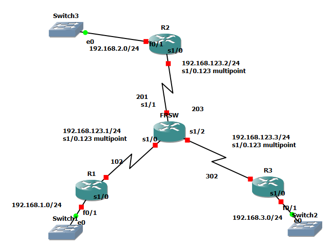

# 9. Lab - Hub&Spoke + EIGRP

## 🗺 토폴로지




```
       R2 (Hub)
   192.168.2.0/24
        |
        | s1/0.123 multipoint
        | 192.168.123.2/24
        |
      [FR-SW]
       /     \
   R1         R3  (Spoke)
192.168.1.0   192.168.3.0
192.168.123.1 192.168.123.3
```

## 📌 조건
- AS = `100`, `no auto-summary`
- 각 Router의 FastEthernet 0/1에 `192.168.x.x/24` 할당
- 모든 네트워크 구간 통신 가능

> ⚠ 사전 조건: `frame-relay map`에 **`broadcast` 옵션이 모두 적용**되어 있어야 함

---

## ⚙ 1단계 - 기본 EIGRP 설정

### R2 (Hub)
```cisco
router eigrp 100
 no auto-summary
 network 192.168.2.2 0.0.0.0
 network 192.168.123.2 0.0.0.0
```

### R1 (Spoke)
```cisco
router eigrp 100
 no auto-summary
 network 192.168.1.1 0.0.0.0
 network 192.168.123.1 0.0.0.0
```

### R3 (Spoke)
```cisco
router eigrp 100
 no auto-summary
 network 192.168.3.3 0.0.0.0
 network 192.168.123.3 0.0.0.0
```

### ⚠ 1단계 결과
```cisco
R1# show ip eigrp neighbor    ! 인접성 1개 (R2만)
R2# show ip eigrp neighbor    ! 인접성 2개 (R1, R3)
R3# show ip eigrp neighbor    ! 인접성 1개 (R2만)

R2# show ip route
C   192.168.123.0/24 is directly connected, Serial1/0.123
D   192.168.1.0/24 [90/2195456] via 192.168.123.1, Serial1/0.123
C   192.168.2.0/24 is directly connected, FastEthernet0/1
D   192.168.3.0/24 [90/2195456] via 192.168.123.3, Serial1/0.123

R1# show ip route
D   192.168.2.0/24 [90/2195456] via 192.168.123.2, Serial1/0.123
! 192.168.3.0/24 없음 ❌

R3# show ip route
D   192.168.2.0/24 [90/2195456] via 192.168.123.2, Serial1/0.123
! 192.168.1.0/24 없음 ❌
```

> **원인**: EIGRP도 **Distance Vector 계열** → Split-Horizon 작용

---

## ⚙ 2단계 - Hub에서 EIGRP Split-Horizon 해제

```cisco
! R2 (Hub)
interface serial 1/0.123
 no ip split-horizon eigrp 100
```

### ✅ 최종 결과
```cisco
R1# show ip route
C   192.168.123.0/24 is directly connected, Serial1/0.123
C   192.168.1.0/24   is directly connected, FastEthernet0/1
D   192.168.2.0/24 [90/2195456] via 192.168.123.2, Serial1/0.123
D   192.168.3.0/24 [90/2707456] via 192.168.123.2, Serial1/0.123
R1# ping 192.168.3.3 source 192.168.1.1   ! ✅


R2# show ip route
C   192.168.123.0/24 is directly connected, Serial1/0.123
D   192.168.1.0/24 [90/2195456] via 192.168.123.1, Serial1/0.123
C   192.168.2.0/24 is directly connected, FastEthernet0/1
D   192.168.3.0/24 [90/2195456] via 192.168.123.3, Serial1/0.123


R3# show ip route
C   192.168.123.0/24 is directly connected, Serial1/0.123
D   192.168.1.0/24 [90/2707456] via 192.168.123.2, Serial1/0.123
D   192.168.2.0/24 [90/2195456] via 192.168.123.2, Serial1/0.123
C   192.168.3.0/24 is directly connected, FastEthernet0/1
R3# ping 192.168.1.1 source 192.168.3.3   ! ✅
```

---

## 🧹 정리

```cisco
! R1, R2, R3
no router eigrp 100
```
